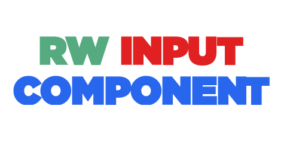

# InputComponent

Rodblogan Warfare's InputComponent Library realized in TypeScript.

## Overview

### What was InputComponent in RW?
InputComponent (specifically InputComponent V2) was the game's input system for many years (and it still is).

## What were its features?
InputComponent featured the following:

- Rebindable inputs
- Input Schemes (for organizing inputs by purpose in the game)
- Gamepad Input Modes (for making gameplay on Xbox more manageable with the press of either the DPadUp or DPadDown buttons)
- A custom selection system (for Xbox users)
- Full integration with ProximityPrompt instances.
- A circular menu.
- Input axes (both polled and non-polled).
- A Character controller (based on the one from the player module, but more versatile)
- Platform adaptability (used for platform-agnostic code).
- Grid-based placement
- Haptic feedback
- Inventory input support (for equpping things with the number keys)
- Input icons (via spritesheets)
- Modular ways of processing all of the above.

## Contributing 

For Contribution Guidelines, see [CONTRIBUTING.md]() for details.
